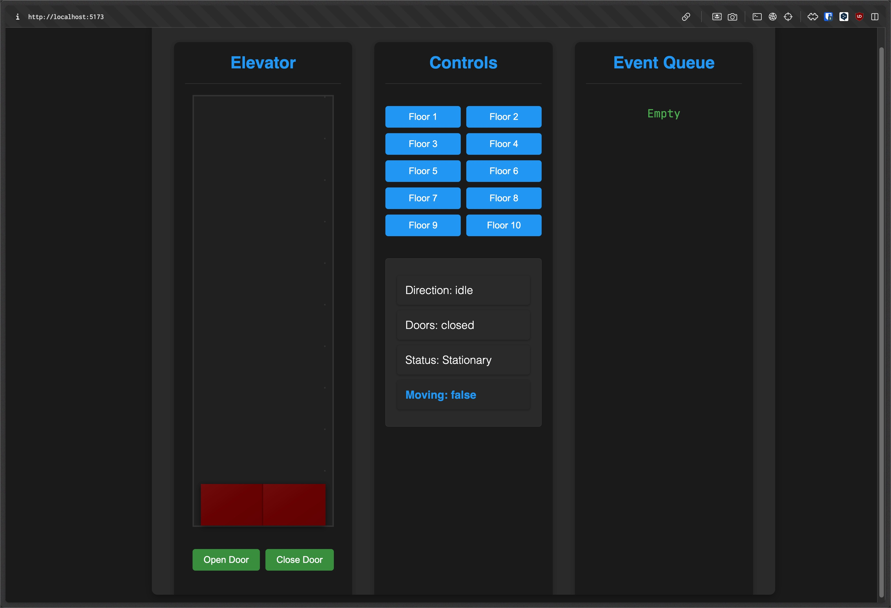

# Elevator Project

## Introduction
This project simulates an elevator system. It is built using TypeScript and Vite for a modern development experience. The simulation includes realistic elevator mechanics, door animations, and floor management.



## Features
- Real-time elevator simulation
- Smooth door animations
- Floor request management
- TypeScript for type safety
- Modern development setup with Vite
- Responsive design

## Getting Started

### Prerequisites
- Node.js (v14 or higher)
- npm or yarn

### Installation
1. Clone the repository:
   ```bash
   git clone <repository-url>
   ```
2. Navigate to the project directory:
   ```bash
   cd elevator
   ```
3. Install the dependencies:
   ```bash
   npm install
   ```

### Running the Project
To start the development server, run:
```bash
npm run dev
```
The application will be available at `http://localhost:5173`

### Building the Project
To build the project for production, run:
```bash
npm run build
```
This will generate optimized files in the `dist` directory.

### Previewing the Build
To preview the production build, run:
```bash
npm run preview
```

## Project Structure
```
elevator/
├── src/
│   ├── main.ts             # Application entry point
│   ├── elevator.ts         # Core elevator logic
│   └── elevator-doors.ts   # Elevator doors logic
├── public/
│   ├── fonts/              # Project fonts
│   └── style.css           # Global styles
└── index.html              # Main HTML file
```

## Technologies Used
- TypeScript
- Vite
- HTML5
- CSS3

## Development
The project uses several development tools:
- Prettier for code formatting
- TypeScript for static typing
- Vite for fast development and building

## Contributing
1. Fork the repository
2. Create your feature branch (`git checkout -b feature/amazing-feature`)
3. Commit your changes (`git commit -m 'Add some amazing feature'`)
4. Push to the branch (`git push origin feature/amazing-feature`)
5. Open a Pull Request

## License
This project is licensed under the MIT License - see the LICENSE file for details.